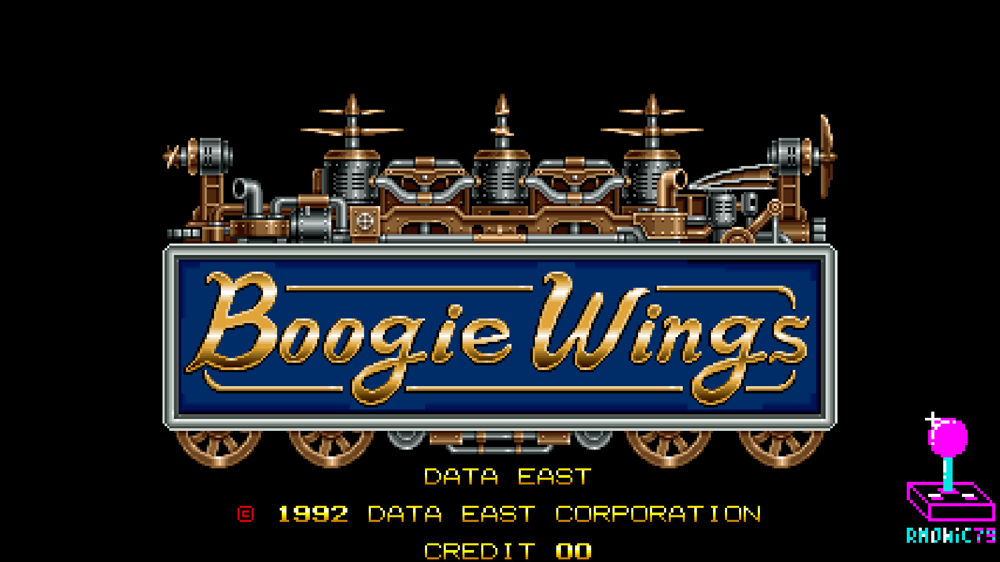
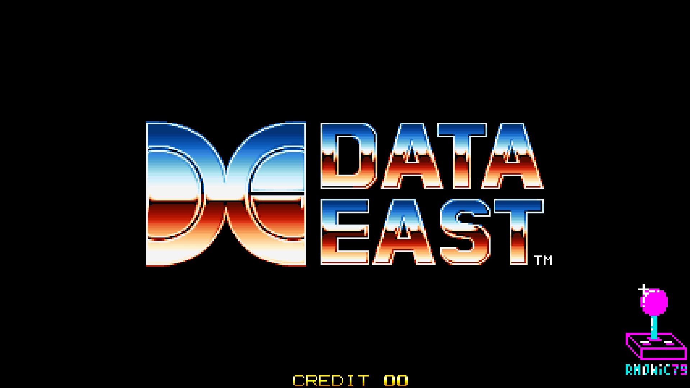
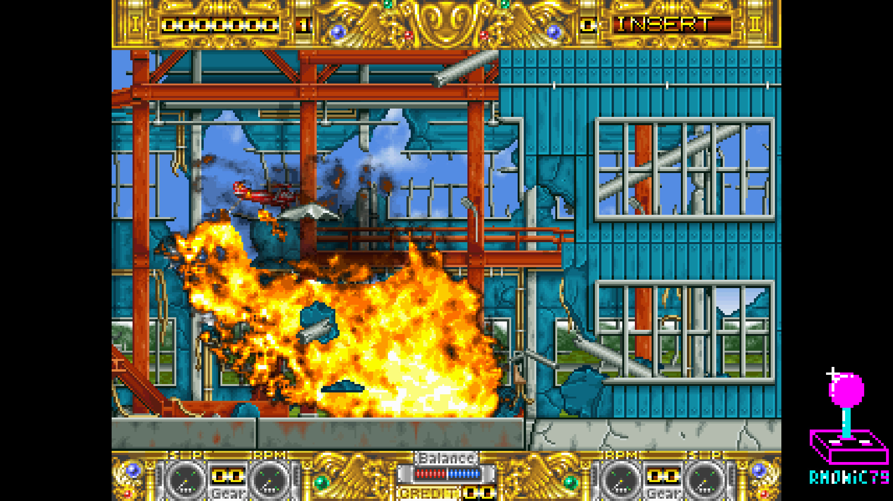
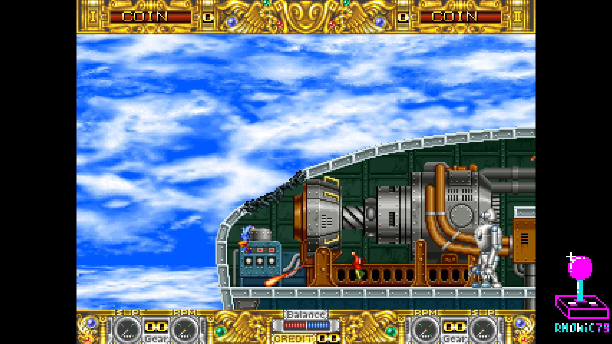
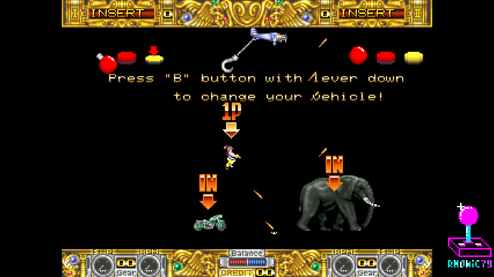
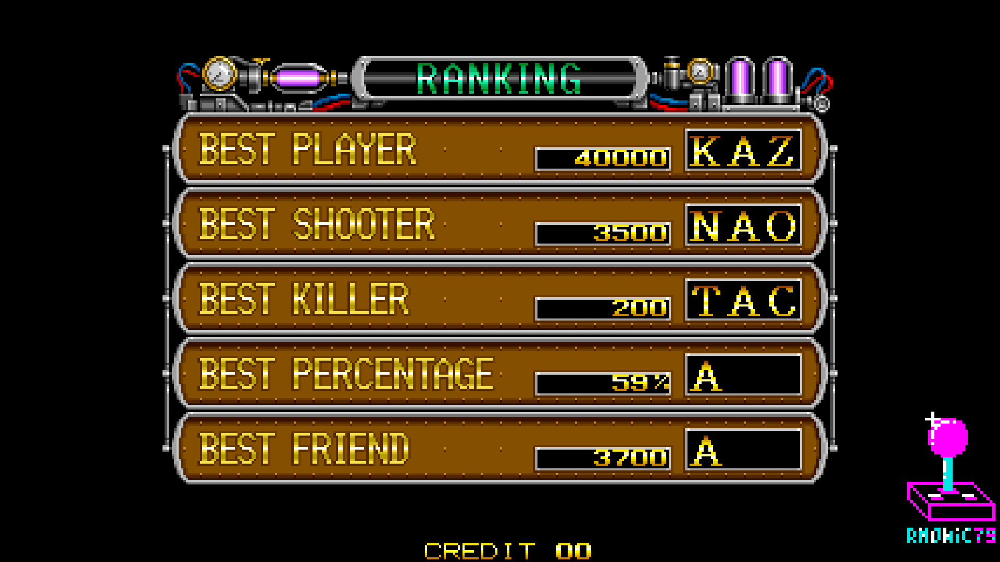

# Arcade-BoogieWings_MiSTer

FPGA core for **Boogie Wings** (also known as **The Great Ragtime Show**,
Data East Corporation, 1992) targeting the
[MiSTer FPGA](https://github.com/MiSTer-devel) platform (Terasic DE10-Nano).

Boogie Wings runs on the **Data East DE-0297 board** — a horizontal arcade
hardware with a 68000 main CPU, HuC6280 sound CPU, two DECO16IC tilemap
chips (four scrolling playfields), a custom sprite generator, the DECO ACE
alpha-blend mixer, DECO104 protection, and YM2151 + dual OKI M6295 audio.

This core reimplements the hardware in SystemVerilog from MAME references
and hardware observation.

## About the game

**Boogie Wings** (*The Great Ragtime Show* in Japan) is a horizontally
scrolling shoot-'em-up with a twist: you pilot a WWI-era biplane, but you
can bail out at any moment and drop down to fight on foot, grabbing a
grappling hook to swing across the stage, hijack enemy vehicles, and hurl
objects at your foes. The mix of aerial and ground combat, the destructible
scenery and the hand-drawn cartoon art make it one of Data East's most
distinctive action games. The DE-0297 board pushes four scrolling
playfields blended through the DECO ACE mixer, giving the game its layered,
colourful look.

## Status

**Current version: 1.0** (July 2026).

The core runs the full game with audio, inputs and savestates, tested on
real MiSTer hardware.

**Milestones reached**
- Full playthrough with accurate video, audio and controls
- The DE102 encrypted 68000 opcodes and the DECO56 tile scramble are
  decrypted on board during ROM download — no pre-decrypted ROMs needed
- DECO104 protection (I/O + data scramble) reproduced from MAME
- MAME-accurate DECO16IC tilemaps (per-row / per-column scroll) and the
  DECO ACE alpha-blend + fade mixer
- Savestate (save / restore) ported from the Taito F2 core, including the
  HuC6280 / YM2151 / OKI internal state
- Native 57.8 Hz refresh with an optional 60 Hz mode

**Roadmap**
- Further audio and video accuracy polish
- Additional savestate hardening across edge cases
- More regional ROM sets as they are verified

**Features**
- 68000 main CPU (FX68K core) with DECO104 protection (I/O + scramble)
- HuC6280 sound CPU @ 8.055 MHz
- Two DECO16IC tilemap chips: BG0/BG1 (chip 0) + FG0/FG1 (chip 1),
  16×16 and 8×8 tiles, per-row and per-column scroll — MAME-accurate
- DECO ACE alpha-blend / fade mixer for layer composition
- Sprite renderer with priority, flip, 16×16 4bpp tiles, buffered sprite RAM
- Audio: YM2151 (OPM, JT51) + two OKI M6295 ADPCM (JT6295)
- Tile ROM streaming through a 4-bank SDRAM (JTFRAME SDRAM64)
- Sprite ROM and OKI ADPCM ROM backed by DDR3
- VBlank-synchronized pause (frame-aligned, no race conditions)
- **Analog VGA H-Shift / V-Shift** OSD options for fine alignment on CRTs
- MiSTer OSD with video and DIP options
- Pause overlay with logo + supporters scroll
- Savestate (save/restore) infrastructure ported from the Taito F2 core

**ROM sets supported**
- Boogie Wings (`boogwing`, Euro v1.5, 92.12.07) — parent
- Boogie Wings (`boogwinga`, Asia v1.5, 92.12.07)
- Boogie Wings (`boogwingu`, USA v1.7, 92.12.14)
- The Great Ragtime Show (`ragtime`, Japan v1.5, 92.12.07)
- The Great Ragtime Show (`ragtimea`, Japan v1.3, 92.11.26)

## Screenshots

| | |
|---|---|
|  |  |
| Title screen | Data East |
|  |  |
| Gameplay | Gameplay |
|  |  |
| Tutorial | High scores |

## Hardware emulated

| Component        | Spec                                                |
|------------------|-----------------------------------------------------|
| Main CPU         | M68000 @ 14 MHz (DE102 encrypted opcodes)           |
| Sound CPU        | HuC6280 @ 8.055 MHz                                  |
| Sound chip 1     | Yamaha YM2151 OPM (jt51)                             |
| Sound chip 2     | OKI M6295 (jt6295) ×2 — 1 MHz and 2 MHz             |
| Tilemaps         | DECO16IC ×2 (four playfields, 16×16 / 8×8)          |
| Sprites          | DECO_SPRITE ×2 (alpha-blend)                         |
| Palette / mixer  | DECO ACE (palette + alpha-blend + fade)             |
| I/O + protection | DECO104                                             |

## Hardware requirements

- Terasic DE10-Nano
- MiSTer I/O board (recommended)
- SDRAM module (32 MB or 64 MB)
- DDR3 memory (built into DE10-Nano, used for sprite ROM and OKI ADPCM ROM)
- Works on HDMI displays and on CRTs via the analog video output

## Building from source

Requires Quartus Prime 17.0 (free Lite Edition).

```
Open BoogieWings.qpf in Quartus → Processing → Start Compilation
```

Output bitstream is generated in `output_files/BoogieWings.rbf`.

## Running on MiSTer

The [releases/](releases/) folder contains the parent MRA and a
prebuilt RBF; regional clone MRAs are in
[releases/alternatives/](releases/alternatives/):

- `Boogie Wings (Euro v1.5, 92.12.07).mra` — parent MRA
- `BoogieWings_YYYYMMDD.rbf` — prebuilt bitstream
- `alternatives/Boogie Wings (Asia v1.5, 92.12.07).mra` / `(USA v1.7, 92.12.14).mra` /
  `The Great Ragtime Show (Japan v1.3 / v1.5).mra` — regional clones

Steps:

1. Copy the `.rbf` to `_Arcade/cores/` on the MiSTer SD card (rename to
   `BoogieWings.rbf` or keep the dated name and update the MRA accordingly).
2. Copy the `.mra` file(s) to `_Arcade/` on the MiSTer SD card.
3. Provide your legally-owned `boogwing.zip` (or regional variant) where
   the MRA expects it (usually in `games/mame/`).

**ROMs are NOT included in this repository.** You must provide them yourself.

## Repository layout

```
Arcade-BoogieWings_MiSTer/
├── rtl/
│   ├── boogwings/   Boogie Wings-specific core RTL
│   ├── common/      shared logic: DECO104, DECO ACE glue, savestate, bridges
│   ├── HUC6280/     HuC6280 sound CPU
│   ├── fx68k/       FX68K M68000 cycle-accurate core
│   ├── jt51/        YM2151 FM synth
│   ├── jt6295/      OKI M6295 ADPCM
│   ├── jtframe/     JTFRAME framework modules
│   ├── pll/         Clock PLL
│   └── sdram.sv     SDRAM controller (Sorgelig)
├── sys/             MiSTer framework (Sorgelig / MiSTer-devel)
├── logo/            Pause overlay assets (font, logo, supporter list)
├── docs/            In-game screenshots
├── releases/        Parent MRA + regional clones + prebuilt RBF
├── BoogieWings.qpf  Quartus project
├── BoogieWings.qsf  Quartus assignments
├── Template.sv      Top-level wrapper
├── Template.sdc     Timing constraints
├── files.qip        HDL file list
├── build_id.v       Build version stamp
└── README.md        This file
```

## Acknowledgements

- **Jose Tejada** ([@jotego](https://github.com/jotego)) for JT51 (YM2151),
  JT6295 (OKI M6295) and the JTFRAME framework (including SDRAM64).
- **Sergey Dvodnenko** ([@srg320](https://github.com/srg320)), with **Sorgelig**
  and **David Shadoff**, for the HuC6280 core (from the MiSTer TurboGrafx-16 /
  PC Engine core); original design by **Gregory Estrade** (FPGAPCE).
- **Jorge Cwik** ([ijor](https://github.com/ijor)) for the **FX68K**
  cycle-accurate M68000 core.
- **Martin Donlon** ([wickerwaka](https://github.com/wickerwaka)) for the
  savestate infrastructure, ported from the Arcade-TaitoF2 core.
- The **MAMEDev team** for the invaluable reference on the DECO16IC tilemaps,
  DECO104 protection, DECO ACE mixer, memory maps and timing.
- **Sorgelig** and the **MiSTer-devel team** for the framework, SDRAM
  controller and Template.

## Support this project

If you enjoy this core and want to support its development:

- [Ko-fi](https://ko-fi.com/ibecerivideoludici) — one-time support
- [Patreon](https://www.patreon.com/IBeceriVideoludici) — monthly support
- [PayPal](https://www.paypal.me/IBeceriVideoludici) — one-time donation

## Follow

- [GitHub](https://github.com/rmonic79)
- [Twitch](https://twitch.tv/ibecerivideoludici) — live streams
- [YouTube](https://www.youtube.com/c/IBeceriVideoludici) — playlists and videos
- [X / Twitter](https://x.com/rmonic79)

## License

The RTL source code in this repository is provided as-is for educational
and preservation purposes under **GNU GPL v3 or later**. Original ROM data
is not included; users must provide their own legally obtained copies.

Original *Boogie Wings* / *The Great Ragtime Show* arcade hardware
© Data East Corporation, 1992.
